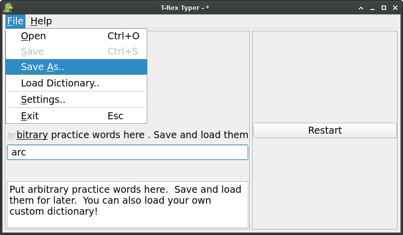

 *Exercise your shorthand!*

# T-Rex Typer
A desktop application to improve steno writing.



# Install
The T-Rex Typer is developed using GNU/Linux with Python3.9.  Although
not yet tested with other operating systems and distributions, it
should work with Python>=3.6.  Please reach out if you have tried the
T-Rex Typer with a different Python version and encountered errors.

The T-Rex Typer must be run from Python.

```python
pip install t_rex_typer
```

Run with

```t_rex_typer```

or

```python -m t_rex_typer```
